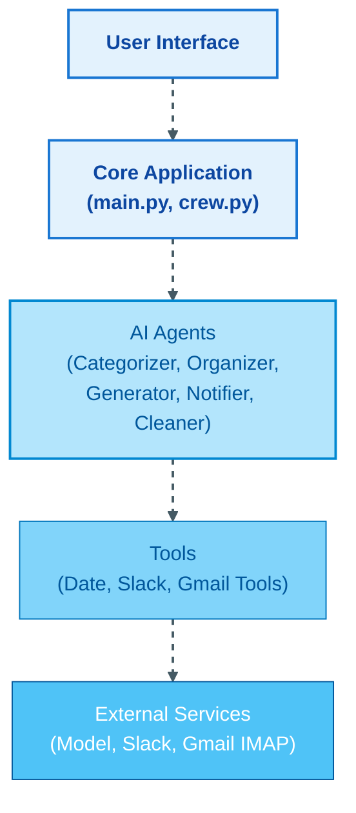

# CrewAI Gmail Automation

An intelligent email management system that leverages CrewAI and large language models to automate Gmail organization, responses, and cleanup.

## ✨ Features

- **📋 Email Categorization**: Automatically categorizes emails into specific types (newsletters, promotions, personal, etc.)
- **🔔 Priority Assignment**: Assigns priority levels (HIGH, MEDIUM, LOW) based on content and sender with strict classification rules
- **🏷️ Smart Organization**: Applies Gmail labels and stars based on categories and priorities
- **💬 Automated Responses**: Generates draft responses for important emails that need replies
- **📱 Slack Notifications**: Sends creative notifications for high-priority emails
- **🧹 Intelligent Cleanup**: Safely deletes low-priority emails based on age and category
- **🎬 YouTube Content Protection**: Special handling for YouTube-related emails
- **🗑️ Trash Management**: Automatically empties trash to free up storage space
- **🧵 Thread Awareness**: Recognizes and properly handles email threads

## System Architecture



## 🚀 Installation

```bash
# Clone the repository
git clone https://github.com/1elango/Automated-Email-Responder-Agent.git
cd Automated-Email-Responder-Agent

# Create and activate a virtual environment
python -m venv .venv
.venv\Scripts\activate

# Install dependencies
crewai install
```

## ⚙️ Configuration

1. Create a `.env` file in the root directory with the following variables:

```
# Choose your LLM provider

# Or Gemini
# MODEL=gemini/gemini-2.0-flash
# GEMINI_API_KEY=your_gemini_api_key

# Gmail credentials
EMAIL_ADDRESS=your_email@gmail.com
APP_PASSWORD=your_app_password

# Optional: Slack notifications
SLACK_WEBHOOK_URL=your_slack_webhook_url
```

<details>
<summary><b>🔑 How to create a Gmail App Password</b></summary>

1. Go to your Google Account settings at [myaccount.google.com](https://myaccount.google.com/)
2. Select **Security** from the left navigation panel
3. Under "Signing in to Google," find and select **2-Step Verification** (enable it if not already enabled)
4. Scroll to the bottom and find **App passwords**
5. Select **Mail** from the "Select app" dropdown
6. Select **Other (Custom name)** from the "Select device" dropdown
7. Enter `Gmail CrewAI` as the name
8. Click **Generate**
9. Copy the 16-character password that appears (spaces will be removed automatically)
10. Paste this password in your `.env` file as the `APP_PASSWORD` value
11. Click **Done**

**Note**: App passwords can only be created if you have 2-Step Verification enabled on your Google account.
</details>

<details>
<summary><b>🔗 How to create a Slack Webhook URL</b></summary>

1. Go to [api.slack.com/apps](https://api.slack.com/apps)
2. Click **Create New App**
3. Select **From scratch**
4. Enter `Gmail Notifications` as the app name
5. Select your workspace and click **Create App**
6. In the left sidebar, find and click on **Incoming Webhooks**
7. Toggle the switch to **Activate Incoming Webhooks**
8. Click **Add New Webhook to Workspace**
9. Select the channel where you want to receive notifications
10. Click **Allow**
11. Find the **Webhook URL** section and copy the URL that begins with `https://hooks.slack.com/services/`
12. Paste this URL in your `.env` file as the `SLACK_WEBHOOK_URL` value

**Customizing your Slack app (optional):**
1. Go to **Basic Information** in the left sidebar
2. Scroll down to **Display Information**
3. Add an app icon and description
4. Click **Save Changes**

**Note**: You need admin permissions or the ability to install apps in your Slack workspace.
</details>

## Project Structure

```
Automated-Email-Responder-Agent/
├── src/
│   ├── main.py
│   ├── gmail_utils.py
├── models/
├── utils/
├── data/
├── README.md
├── .env
├── .venv/
│   ├── Scripts
│   ├── include
│   ├── Lib
├── requirements.txt
```
## 📧 How It Works

This application uses the IMAP (Internet Message Access Protocol) to securely connect to your Gmail account and manage your emails. Here's how it works:

<details>
<summary><b>🔄 IMAP Connection Process</b></summary>

1. **Secure Connection**: The application establishes a secure SSL connection to Gmail's IMAP server (`imap.gmail.com`).

2. **Authentication**: It authenticates using your email address and app password (not your regular Google password).

3. **Mailbox Access**: Once authenticated, it can access your inbox and other mailboxes to:
   - Read unread emails
   - Apply labels
   - Move emails to trash
   - Save draft responses

4. **Safe Disconnection**: After each operation, the connection is properly closed to maintain security.

IMAP allows the application to work with your emails while they remain on Google's servers, unlike POP3 which would download them to your device. This means you can still access all emails through the regular Gmail interface.

**Security Note**: Your credentials are only stored locally in your `.env` file and are never shared with any external services.
</details>

## 🔍 Usage

Run the application with:

```bash
crewai run
```

You'll be prompted to enter the number of emails to process (default is 5).

The application will:
1. 📥 Fetch your unread emails
2. 🔎 Categorize them by type and priority
3. ⭐ Apply appropriate labels and stars
4. ✏️ Generate draft responses for important emails
5. 🔔 Send Slack notifications for high-priority items
6. 🗑️ Clean up low-priority emails based on age
7. 🧹 Empty the trash to free up storage space

## 🌟 Special Features

- **📅 Smart Deletion Rules**: 
  - Promotions older than 2 days are automatically deleted
  - Newsletters older than 7 days (unless HIGH priority) are deleted
  - Shutterfly emails are always deleted regardless of age
  - Receipts and important documents are archived instead of deleted

- **🎬 YouTube Protection**: All YouTube-related emails are preserved and marked as READ_ONLY (you'll respond directly on YouTube)

- **✍️ Smart Response Generation**: Responses are tailored to the email context and include proper formatting

- **💡 Creative Slack Notifications**: Fun, attention-grabbing notifications for important emails

- **🧵 Thread Handling**: Properly tracks and manages email threads to maintain conversation context

Watch our project walkthrough video for a comprehensive overview:
[Project Walkthrough on Vimeo](https://vimeo.com/1083721124/a169bc6e56?share=copy.

## 📚 References

- [CrewAI](https://github.com/crewAIInc/crewAI/)
- [IMAP Protocol for Gmail](https://support.google.com/mail/answer/7126229)
- [Slack API](https://api.slack.com/messaging/webhooks)
- [Gemini](https://ai.google.com/gemini-api)
- [OpenAI](https://openai.com/api/)
